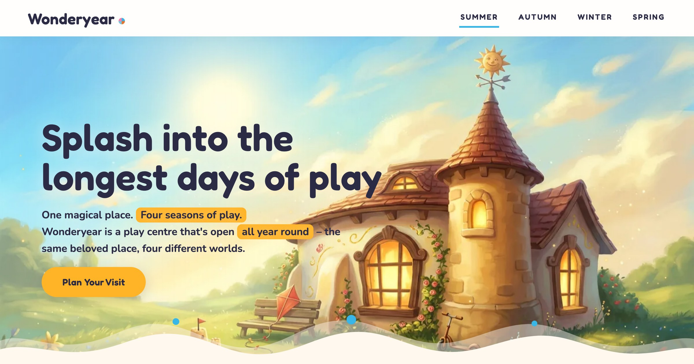

# WONDERYEAR — Landing Page README

**WONDERYEAR** presents a fictional year-round children's play centre through a single page built around one promise: *one magical place, four seasons of play*. The project demonstrates vanilla web development—no frameworks, dependencies, or build tools required.

## Core Concept

The site has no traditional navigation—the only menu is four words: **SUMMER · AUTUMN · WINTER · SPRING**. The active season is auto-detected from the visitor's date, and clicking a season transforms the *entire* page in place, never a reload: hero artwork, adventures, map, quotes, pass names, sky gradients and the underground footer all swap to the chosen season. It moves visitors through seven scenes—hero, this season's adventures, the illustrated map, a day at Wonderyear, parents say, pick your adventure, and the visit/footer—each rebuilt so the same beloved place becomes four different worlds.

## Technical Highlights

The implementation uses **plain HTML, CSS, and JavaScript** with `IntersectionObserver` and `requestAnimationFrame` for scroll reveals and cinematic transitions. Key features include:

- Clean three-file structure—`index.html`, `styles.css`, `app.js`—no framework, zero runtime dependencies
- "Season Bloom" hero transition: an animated `clip-path` watercolor mask led by a single recycled-particle `<canvas>` burst (snow, leaves, petals, fireflies)
- CSS custom properties drive all seasonal accent theming for instant, cheap below-fold switching
- Date-based season auto-detect, with keyboard (← →) and swipe navigation
- All four hero sets preloaded before the switcher is enabled
- Semantic landmarks, alt text on every illustration, and `aria-live` season announcements
- Fully responsive from 360px to 1920px, verified across six viewports with Playwright
- WCAG-AA contrast, plus full `prefers-reduced-motion` fallback (layered crossfade, no particles)
- Self-hosted assets optimized to **WebP** (≈97% smaller than the source PNGs)

## Design System

A "Living Palette" anchors the brand: Storybook Ink (`#2B2B45`) for all typography and UI over Paper Cream (`#FFF8EF`) surfaces, with Sunbeam (`#FFB427`) reserved for the logo and the single primary CTA. Each active season takes over the accent details—Summer Sky Pop (`#38B6E8`), Autumn Amber Rust (`#E8722C`), Winter Frost Blue (`#7BC4E0`), Spring Blossom Pink (`#F27EB2`)—with a maximum of three colors visible per viewport. Typography pairs **Fredoka** for display headings with **Nunito** for body and UI.

## Getting Started

Run locally with any static server: `python3 -m http.server 8777`

**Live site:** [wonderyear.vercel.app](https://wonderyear.vercel.app)

---

Crafted by [WEBDEVCAVEMAN](https://webdevcaveman.com)
